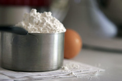

[June 30 (flour)](http://www.flickr.com/photos/romanlily/694856387/)

Originally uploaded by [romanlily](http://www.flickr.com/people/romanlily/) Since I got back from SFBI I've been trying to figure out what to do with my flour. Around the time I switched to organic unbleached flour back in November I've been struggling with pale loaves. We talked about this at school and I suspect that the organic flour might be the culprit. It all comes down to enzyme activity:

\* enzymes (specifically, amalyse) breaks down the starch in flour into simple sugars. \* the simple sugars are needed for yeast food, but left over sugars are what causes nice browning. That is, browning is caramelized sugars

So, you need sufficient enzyme activity to create enough simple sugars to both feed the yeast and have enough left over for a brown crust. How do I know how much enzyme activity is in my flour?

\* Millers use a measurement called the Falling Number to determine enzyme activity. \* Basically, they make a flour and water slurry, put it in a tube, put a weight on the slurry, and wait for the weight to fall. Enzyme activity breaks down the flour which allows the weight to fall. \* Bakers want a falling number between 250 and 300 seconds. \* Conventional (non-organic) bread flour typically meets this falling number requirement, but my organic flour has a higher falling number -- closer to 350 seconds.

Still with me? So my organic flour has a falling number that's too high, which means I don't have enough enzyme activity to create simple sugars for yeast food and also for browning. Well, why not? And why does my Robin Hood flour not have this issue? It comes down to grain storage:

\* Enzyme activity increases as the wheat berries get close to sprouting. ie. moisture is introduced. \* However, any grain farmer will tell you he wants dry grain in the bin so it doesn't spoil. \* Millers are no different. They want nice dry, stable grain in the bin to grind flour from. \* Conventional flour millers add a product called fungal amalyse to their flour after they grind it in order to introduce additional enzyme activity to the flour, while preserving nice dry stable grain in the bin. \* Organic millers don't have this option, so it's up to the baker to do the correcting on his own. Usually this is accomplished by adding 0.5% - 1% malted barley flour to the white flour. Malted = sprouted = lots of enzymes.

So armed with this information, all I have to do is find me some malted barley flour and I can fix my pale loaf problem. BUT, do you think I can find malted barley flour locally? Not yet! I'm afraid I will have to go back to conventional flour (and incur the wrath of my local organic miller) until I can find some malted barley flour in the city. sigh...
